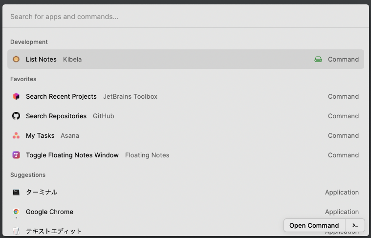

# Raycast Kibela

This is the [Kibela](https://kibe.la/) extension plugin for Raycast.


# Install

## Get the Kibela API access token

https://support.kibe.la/hc/ja/articles/360036089931-API%E3%82%A2%E3%82%AF%E3%82%BB%E3%82%B9%E3%83%88%E3%83%BC%E3%82%AF%E3%83%B3%E3%81%AE%E5%8F%96%E5%BE%97%E6%96%B9%E6%B3%95%E3%82%92%E6%95%99%E3%81%88%E3%81%A6%E3%81%8F%E3%81%A0%E3%81%95%E3%81%84-

## Execute npm

```shell
$ git clone git@github.com:st1t/raycast-kibela.git
$ cd raycast-kibela/
$ npm install && npm run dev
```

## Open and setting Kibela

### top



### settings


- Team
    - Set the team name for Kibela. Usually, the URL part is used. If it is https://changeme.kibe.la, set changeme.
- Token
    - Set the Kibela API token.
- Query Limit
    - Sets the maximum amount of data to be retrieved from Kibela.

# Document

- https://developers.raycast.com/basics/getting-started
- https://developers.raycast.com/information/manifest#preference-properties